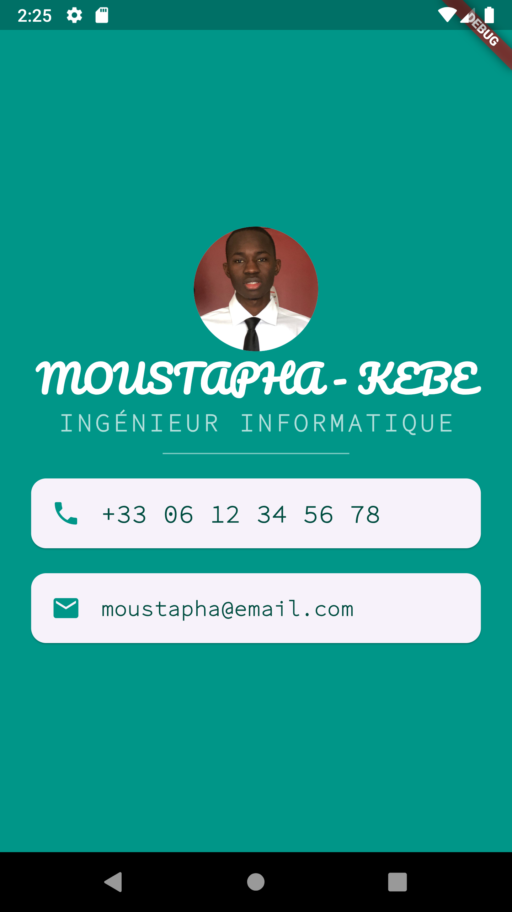

# mi_card

## Mon objectif
Après avoir appris à créer une application Flutter entièrement depuis zéro, j'ai décidé d'aller plus loin pour approfondir mes compétences en conception d'interfaces utilisateur pour les applications Flutter.

## Ce que j'ai créé
Mi Card est ma version numérique d'une carte de visite personnelle. Avec cette application, il suffit que la personne télécharge ma carte de visite en version numérique.

## Ce que j'ai appris
- Créer des Widgets sans état (Stateless Widgets)
- Comprendre et utiliser le hot reload et le hot refresh
- Structurer l'interface utilisateur avec les Containers
- Positionner les éléments avec les Colonnes et Lignes (Columns et Rows)
- Ajouter des polices personnalisées
- Intégrer les icônes Material
- Styliser les widgets de texte (Text)
- Explorer et utiliser la documentation Flutter
